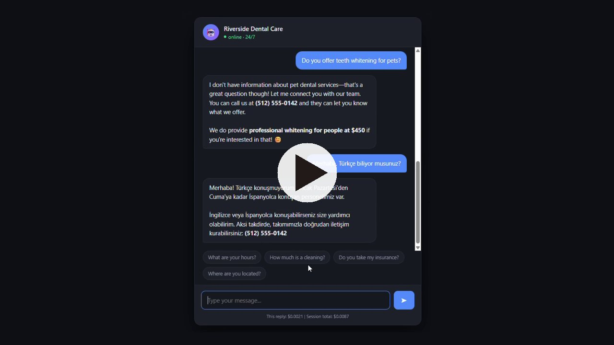

# AI Document Assistant

A customer-facing AI assistant that answers questions **strictly from a
business's own documents** — price lists, opening hours, services, FAQs.

If the answer isn't in the documents, it says so and offers to hand over
to a human. It does not invent answers.

> Türkçe açıklama için: [README.tr.md](README.tr.md)

## Demo

[](https://youtu.be/B319mo_fFxQ)

**▶️ [Watch the 30-second demo](https://youtu.be/B319mo_fFxQ)**

In the clip the assistant is asked about pet teeth whitening — a service the
clinic does not offer and which appears nowhere in its documents. Instead of
inventing an answer it says it doesn't have that information, gives the clinic's
phone number, and offers the whitening service the clinic *does* provide. It is
then asked a question in Turkish and replies in Turkish while staying accurate
about what the clinic actually offers.

The whole conversation cost **$0.0087** to run.

---

## Why

Small businesses lose customers every night: nobody answers the phone or
the WhatsApp message after hours. This assistant answers at 3 a.m. — using
only what the business actually told it.

| Industry | Use case |
|---|---|
| Dental / medical clinics | Pricing, hours, appointment questions |
| Restaurants | Menu, allergens, reservations |
| Real estate | Listing pre-qualification |
| E-commerce | Order status, returns, sizing |
| Hotels | Bookings, amenities, multilingual |

---

## Features

- **Grounded answers** — responds only from the supplied documents;
  escalates to a human when the answer isn't there
- **Streaming responses** — token-by-token, so it feels real-time
- **Prompt caching** — the document set is cached, cutting input cost by
  up to ~90% on larger document sets
- **Live cost tracking** — every reply reports its token usage and cost
- **Preview mode** — the UI runs without an API key, so you can demo the
  interface before wiring up a model
- **Multi-format** — reads `.txt`, `.md` and `.pdf` from `belgeler/`

---

## Quick start

```bash
pip install -r requirements.txt
cp .env.ornek .env          # then paste your API key into .env
python test-anahtar.py      # verifies the key works
python app.py
```

Open http://127.0.0.1:8000

---

## Retargeting to another business

No code changes. Two steps:

1. Replace the files in `belgeler/` with the new business's documents
2. Edit two lines in `app.py`:

```python
ISLETME_ADI = "Meze & Co."
KARAKTER    = "a warm, friendly restaurant host"
```

A worked example is in [`ornekler/`](ornekler/) — the same codebase serving
a restaurant instead of a dental clinic.

**This is the point:** thirty clients don't mean thirty codebases. It means
one codebase and thirty document sets.

---

## Architecture

```
Browser  ──POST /sor──▶  FastAPI  ──▶  Claude API
   ▲                        │              │
   └──── NDJSON stream ◀────┴──────────────┘

System prompt = persona + rules + all documents  (cached)
User messages = full conversation history
```

| Layer | Choice |
|---|---|
| Server | Python 3.12, FastAPI, Uvicorn |
| Model | Anthropic Claude (configurable in `app.py`) |
| Transport | NDJSON over a streaming HTTP response |
| Frontend | Single-file HTML/CSS/JS, no build step |
| Cost control | Prompt caching + per-request usage accounting |

---

## Cost

With Claude Haiku 4.5 and a ~750-token document set, a question costs
roughly **$0.0018**. Larger document sets benefit from prompt caching,
where cached input reads bill at 10% of the base input rate.

---

## Configuration

All settings live at the top of `app.py`:

| Setting | Purpose |
|---|---|
| `ISLETME_ADI` | Business name the assistant represents |
| `KARAKTER` | Persona / tone |
| `MODEL` | `claude-haiku-4-5`, `claude-sonnet-5` or `claude-opus-5` |

---

## License

MIT
